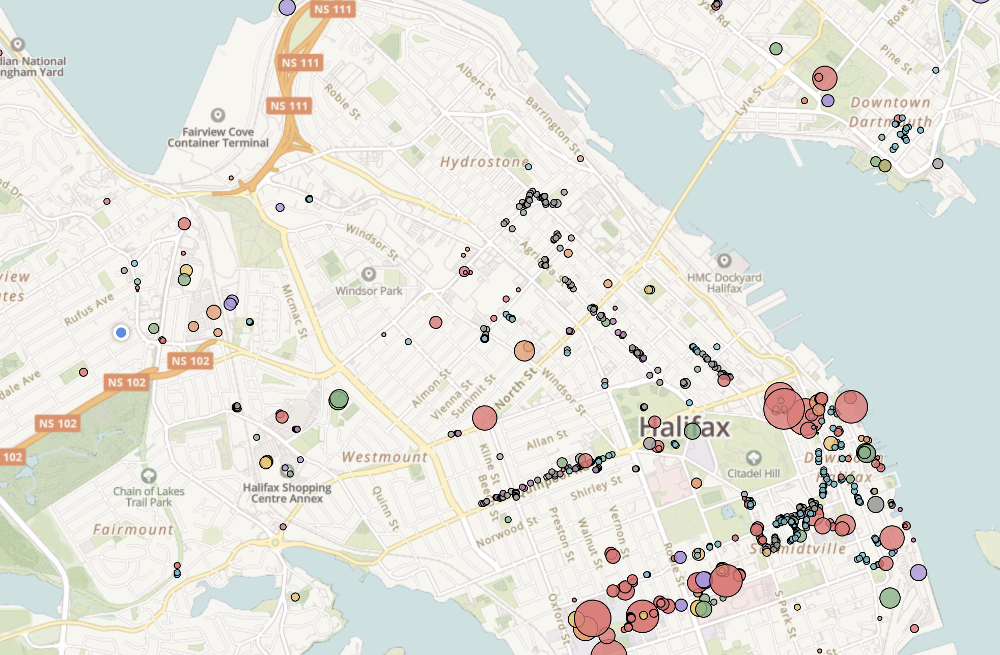

# hfxbikeparking

Render on [justbartek.ca](https://justbartek.ca/hfxbikeparking/)

Spawned from a Twitter thread, this is a open data set of publicly available
bike parking in and around (and sometimes well beyond!) Halifax.



The map aims to be a detailed view of bike parking inventory. This means
street-level positioning and labeling of bike racks into appropriate
categories, with the intent that when someone on a bike is planning a route,
they can have clarity as to how, and if, they can safely lock up their bicycle.

This repository includes the `.geojson` file which is a regular export of the
map details.

## Build

Parking data is broken up into two parts. First, there is a base.geojson file which contains a variety of spots initially mapped, without quality tagging. As a result, these initially mapped spots are plotted grey on the map. The end goal is to remove this and drop the merge process.

The second source of data is a photo library contained on my iCloud account. The data is obtained using `dogsheep/fetch.py` script and then merged with data.geojson using merge.sh. This process can likely be improved, but it works for the time being.

```
dogsheep-photos apple-photos photos.db
ALBUM="hfxbikeparking" python dogsheep/fetch.py > partial.geojson
./merge.sh && mv merged.geojson data.geojson
```

Then commit the diff to push new maps up. The resulting `data.geojson` is the authoritative source.

## Further Work

In addition to being a potentially useful utility, the data contained within
this map may serve as a means of advocacy. Some ideas:

* Analysing bike parking facilities on retail strips
* Identifying inconsistent or unusable (e.g wheel slot) inventory
* Identifying infrastructure that needs repair
* Etc..
